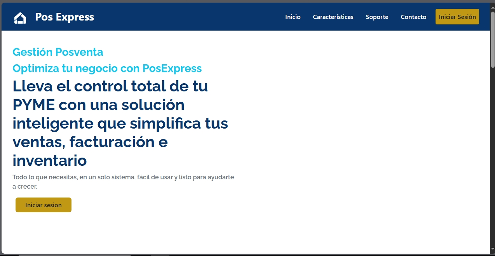
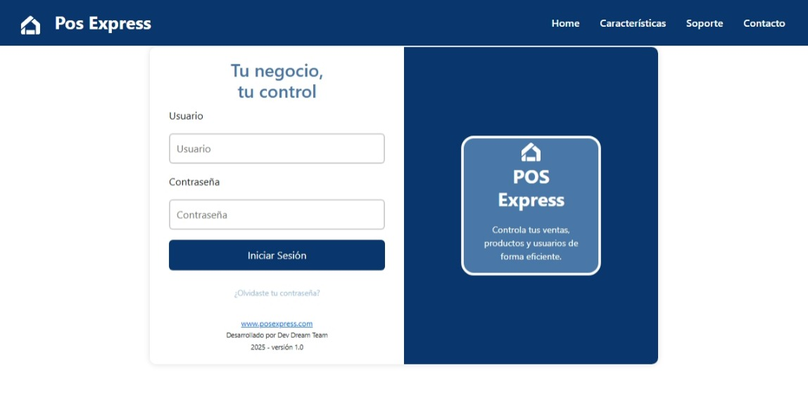
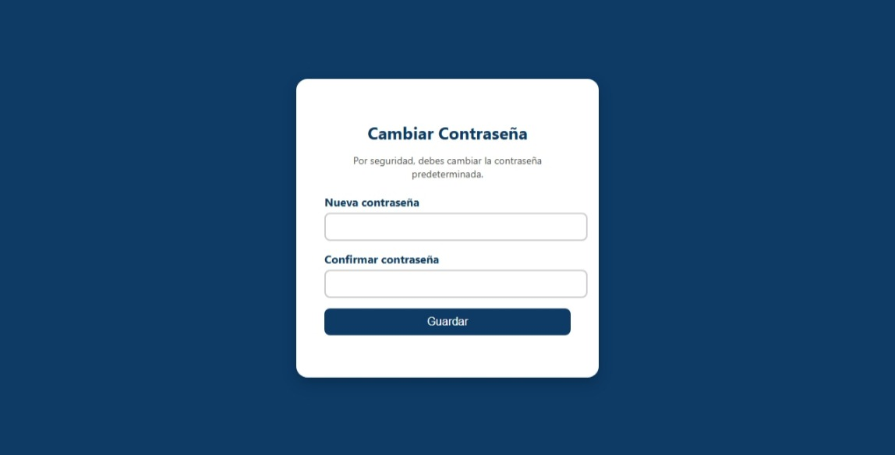

# POS_Express
El sistema consiste en un prototipo navegable de un punto de venta (POS) diseñado para ser ejecutado en entorno local a través de navegador, sin necesidad de conexión a servidores externos. Está enfocado en pequeñas y medianas empresas que necesitan controlar su inventario, realizar ventas, y administrar a los usuarios del sistema.

## 🌐 ¿Qué encontrarás en esta página?
Al ingresar a la página principal de **POS Express**, encontrarás una barra de navegación fija en la parte superior que te permitirá acceder fácilmente a las secciones más importantes del sitio:

---

#### 🔹 Menú de navegación
### 🏠 Inicio  
**Enlace:** `../views/index.html`  
Te lleva a la página principal del sitio, donde encontrarás una introducción al sistema y sus funcionalidades clave.

---

### ✨ Características  
**Enlace:** `#Caracteristicas`  
Este botón te desplaza hacia la sección que describe las principales características del sistema.  
Aquí podrás conocer por qué **POS Express** es una solución ideal para tu negocio.

---

### 🛠 Soporte  
**(Actualmente sin enlace activo)**  
Esta sección está pensada para futuras implementaciones.  
Aquí podrás acceder a ayuda, tutoriales o contacto técnico para resolver dudas o inconvenientes.

---

### 📞 Contacto  
**Enlace:** `#footer`  
Te dirige al pie de página, donde encontrarás información para comunicarte con el equipo de **POS Express**.

---

### 🔐 Iniciar Sesión  
**Enlace:** `login.html`  
Abre el formulario de inicio de sesión para ingresar al sistema si ya tienes una cuenta registrada.

Sitio en vivo https://mpadilla16.github.io/Pos_Express/views/index.html

#### Screenshot

Sitio en vivo https://mpadilla16.github.io/Pos_Express/views/index.html

#### ¿Qué más puedes ver?
Además del menú de navegación, la página incluye:
Una sección de bienvenida con un mensaje motivador y una invitación a iniciar sesión.
Una sección de tarjetas que describe:
Las funcionalidades destacadas del sistema.
La seguridad avanzada que ofrece POS Express.
La facilidad de uso y su interfaz amigable.

#### ✅ Recomendaciones
📱 La página está diseñada para verse correctamente en dispositivos móviles gracias a Bootstrap, así que puedes acceder desde tu celular o tablet sin problemas.

#### 🔐 Recuerda que para acceder al sistema debes contar con un usuario y contraseña válidos. Si no tienes uno, contacta con el administrador de POS Express.

## 🔐 Iniciar Sesión en POS Express

La plataforma incluye un sistema básico de autenticación para ingresar al entorno del punto de venta (POS). Esta funcionalidad está pensada para simular un inicio de sesión en un entorno real de sistema empresarial.

### 🧑 Usuario de prueba
Puedes iniciar sesión con las siguientes credenciales:

- **Usuario:** `admin`
- **Contraseña:** `admin123`

### 🔁 Comportamiento del Login

- Si los datos ingresados son correctos, el sistema mostrará una alerta informativa indicando que debes cambiar la contraseña.
- Luego, serás redirigido automáticamente al formulario de recuperación/cambio de contraseña.

> ⚠️ Este flujo simula un proceso de seguridad donde el usuario predeterminado debe actualizar sus credenciales.

### 📍 Acceso al Login
Puedes acceder al formulario de inicio de sesión desde la barra de navegación en la parte superior del sitio, haciendo clic en **"Iniciar Sesión"**.  
Este enlace te lleva a: `login.html`

---

### 🧾 Descripción técnica
- El formulario incluye campos para **usuario** y **contraseña**.
- Está validado con JavaScript puro en el frontend.
- No hay conexión a una base de datos ni backend, ya que es un prototipo funcional para entorno local.

### Screenshot

# 🔐 Redirección automática al cambiar contraseña

> ⚠️ **Nota:** Por favor conservar la contraseña y el usuario anterior.

- **Usuario:** `admin`  
- **Contraseña:** `admin123`

Cuando se utiliza la contraseña predeterminada, el sistema redirige automáticamente al formulario **"Cambiar Contraseña"** como medida de seguridad.

---

## 🛠️ Funcionalidad del formulario

El formulario de cambio de contraseña permite ingresar dos campos:

- **Nueva contraseña**
- **Confirmar contraseña**

---